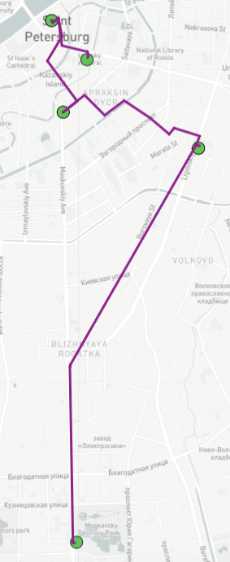
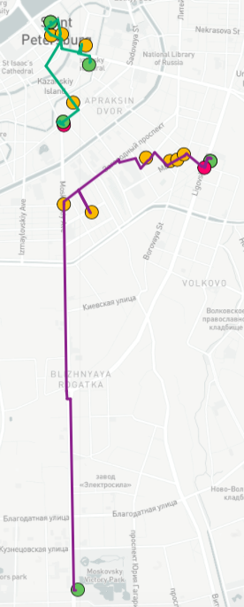
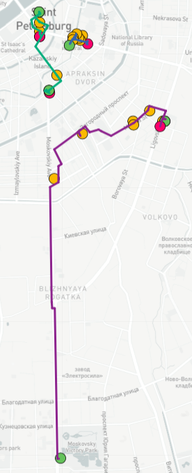

#  Walking tour generation using multi-source attraction points data 

In this work, the method for walking tour generation is presented. The obtained routes satisfy time conditions: time spent per day and vacation duration. In addition to that, for several days vacation route is balanced and starts and ends at subway stations. For routes construction, the Ant Colony Optimization is used for enrichment based route of locations selected by user. The achieved routes were compared to walking paths from official touristic guide. 

## Experiments

### Official route enrichment

First example is improvement one-day routes from Official City Guide. All points from walking path were taken as mandatory locations with maximum time for whole route equaled to 10 hours. On the figure below, the route '[Alongside the Moika river]' (http://www.visit-petersburg.ru/en/route/20/) is shown, it is clear that improved path (interactive map) is quite similar to the original path. This results is caused by several time-consuming mandatory locations, however the initial number of locations almost doubled (6 and 11 for original and improved paths, respectively). All additional locations belongs to 'Sights \& Landmarks' category and requires not more than 15 minutes to visit.

  
