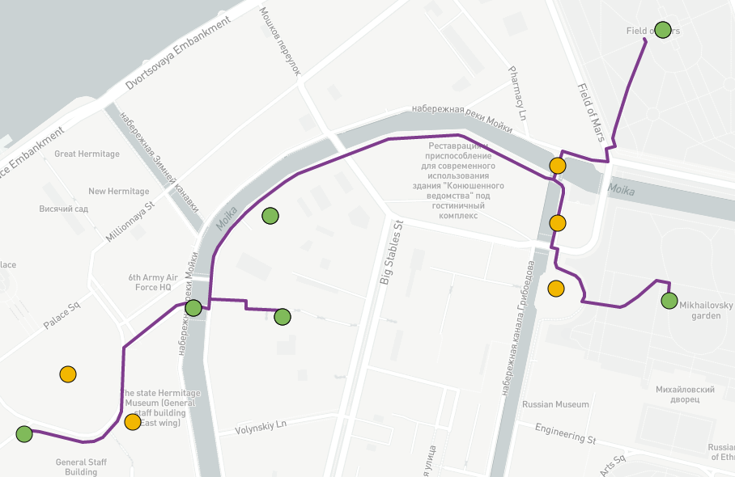
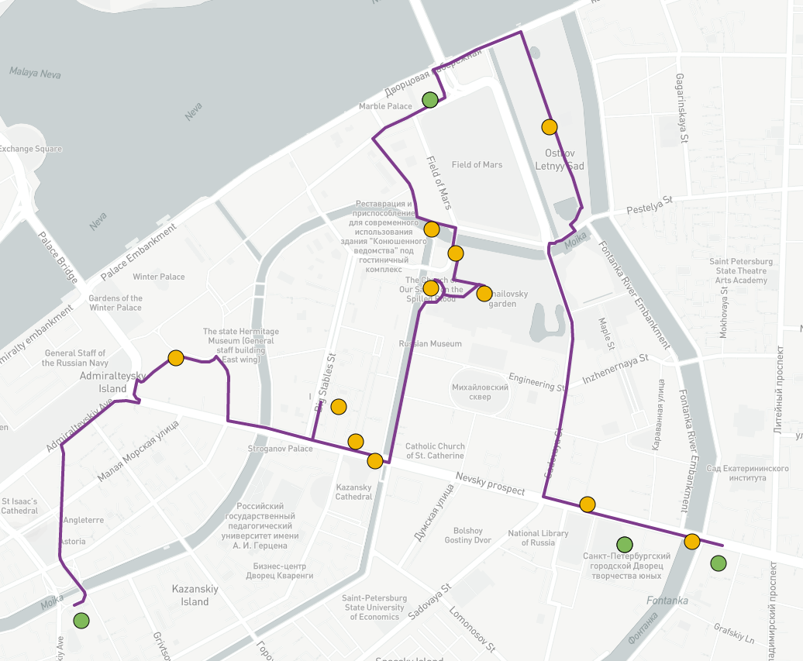

#  Walking tour generation using multi-source attraction points data 

Generated routes satisfy time conditions: time spent per day (10 hours) and vacation's duration. For routes construction, the Ant Colony Optimization is used to enrich based route by usage multi-source dataset based on Official City Guide, TripAdvisor, and Instagram.

## Experiments

### Official route enrichment

Points from walking path were taken as mandatory locations. On the figure below, the route <a href='http://www.visit-petersburg.ru/en/route/20/' target="_blank">Alongside the Moika river</a> is shown; <a href='https://mukhinaks.github.io/walking-route-generation/4.3-official-improved-route-1.html' target="_blank">improved path</a> is close to the raw route. This results is caused by several time-consuming locations, however the initial number of locations almost doubled (6 and 11 for original and improved paths, respectively).

 

In contrast, route <a href='http://www.visit-petersburg.ru/en/route/13/' target="_blank">Grand Ducal Petersburg</a> has small number of places, and the obtained results differ significantly. The <a href='https://mukhinaks.github.io/walking-route-generation/4.3-official-improved-route-2.html' target="_blank">enrichment path</a> contains 15 locations including 4 mandatory locations from raw route and 11 extra. 

 

### Comparison of 1-, 2-, and 3-days walking paths

Park Pobedy, Sennaya ploschad' (square), Loft Project Floors Exhibition Hall, The State Hermitage Museum, Kazan Cathedral were taken as initial locations. As can be seen from the figures below, due to daily time limit new locations can not be added to path, so the route contains sonly mandatory locations. In contrast, walking path could be easily managed in 2 days, locations was balanced between two days, that is way the first-day route (purple line) contains less mandatory locations than in single-day route. The path for second day (green line) also starts from subway station and ends in last location in mandatory list. 3-days path contains more interesting places for intervals in second and third days due to the balancing. The resulting scores are 0, 29.58, and 37.40 for 1, 2, and 3 days, respectively. The total route for single-day route contains only 5 mandatory locations; 2-days route includes 10 places for first day and 7 places for second day excluding subway stations; 3-days route contains of 19 locations in total where 7 places are planned to visit in first day, 5 places for second day, and 7 places in last day.

  
