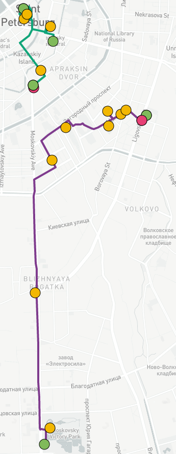

#  Walking tour generation using multi-source attraction points data 

In this work, the method for walking tour generation is presented. The obtained routes satisfy time conditions: time spent per day and vacation duration. In addition to that, for several days vacation route is balanced and starts and ends at subway stations. For routes construction, the Ant Colony Optimization is used for enrichment based route of locations selected by user. The achieved routes were compared to walking paths from official touristic guide. 

## Experiments

### Official route enrichment

First example is improvement one-day routes from Official City Guide. All points from walking path were taken as mandatory locations with maximum time for whole route equaled to 10 hours. On the figure below, the route [Alongside the Moika river](http://www.visit-petersburg.ru/en/route/20/) is shown, it is clear that [improved path](https://mukhinaks.github.io/walking-route-generation/4.3-official-improved-route-1.html)  is quite similar to the original path. This results is caused by several time-consuming mandatory locations, however the initial number of locations almost doubled (6 and 11 for original and improved paths, respectively). All additional locations belongs to 'Sights & Landmarks' category and requires not more than 15 minutes to visit.

  

In contrast, route [Grand Ducal Petersburg](http://www.visit-petersburg.ru/en/route/13/) has small number of places, and the obtained result differs significantly. The [enrichment path](https://mukhinaks.github.io/walking-route-generation/4.3-official-improved-route-2.html) contains 15 locations including 4 mandatory locations from raw route and 11 extra. 

 

### Case study

To illustrate differences for 1-, 2-, and 3-days walking paths, the initial locations list was taken. As can be seen from the figures below, due to daily time limit new locations can not be added to path, so the route contains sonly mandatory locations. In contrast, walking path could be easily managed in 2 days, locations was balanced between two days, that is way the first-day route (purple line) contains less mandatory locations than in single-day route. The path for second day (green line) also starts from subway station and ends in last location in mandatory list. 3-days path contains more interesting places for intervals in second and third days due to the balancing. The resulting scores are 0, 27.54, and 37.40 for 1, 2, and 3 days, respectively. The total route for single-day route contains only 5 mandatory locations; 2-days route includes 8 places for first day and 7 places for second day excluding subway stations; 3-days route contains of 19 locations in total where 7 places are planned to visit in first day, 5 places for second day, and 7 places in last day.

  
